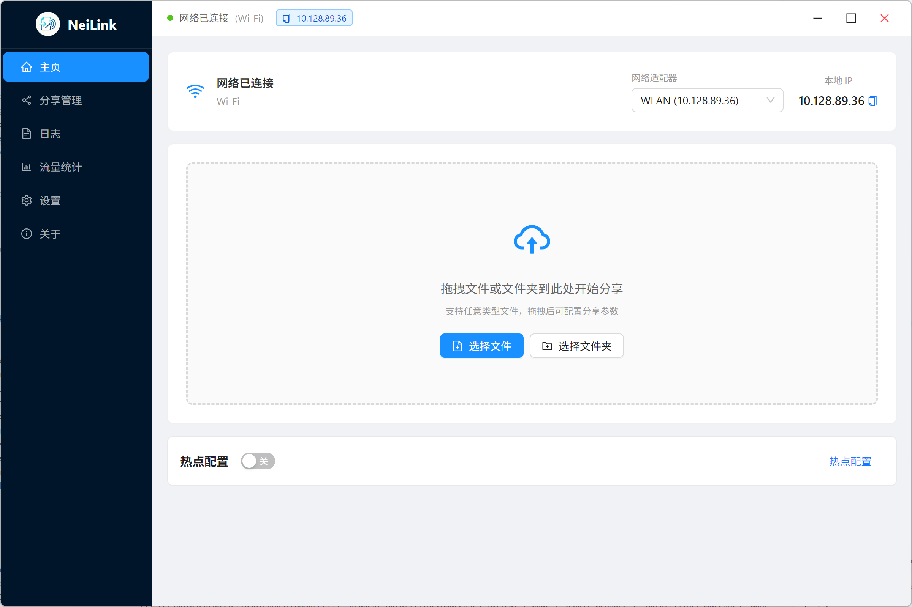
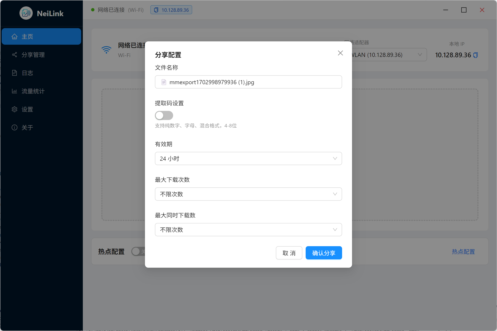
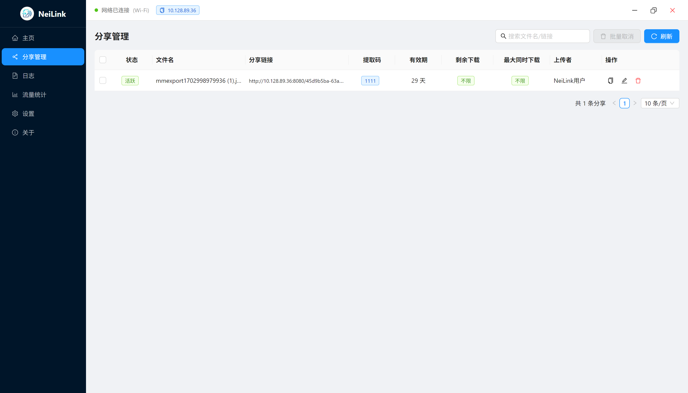
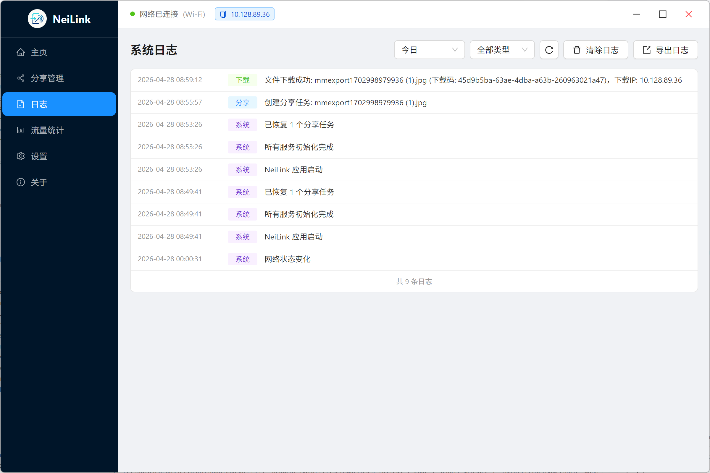
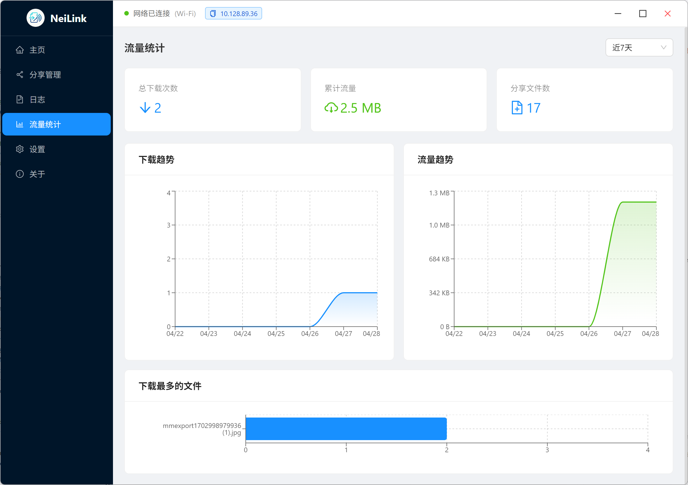
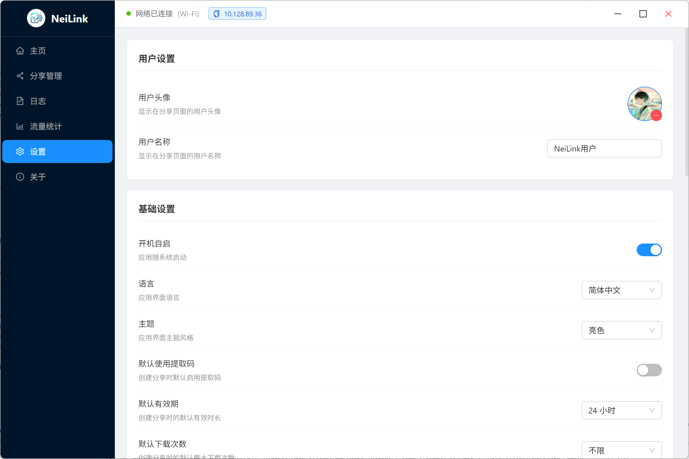
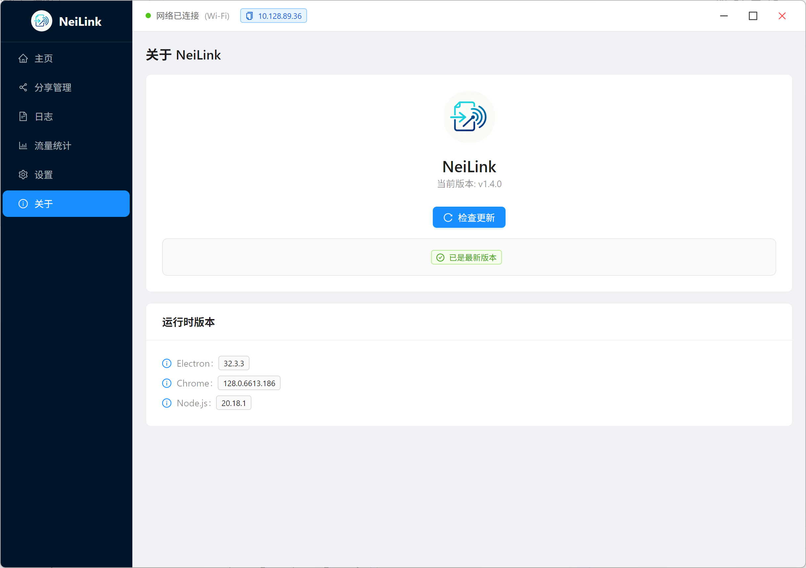
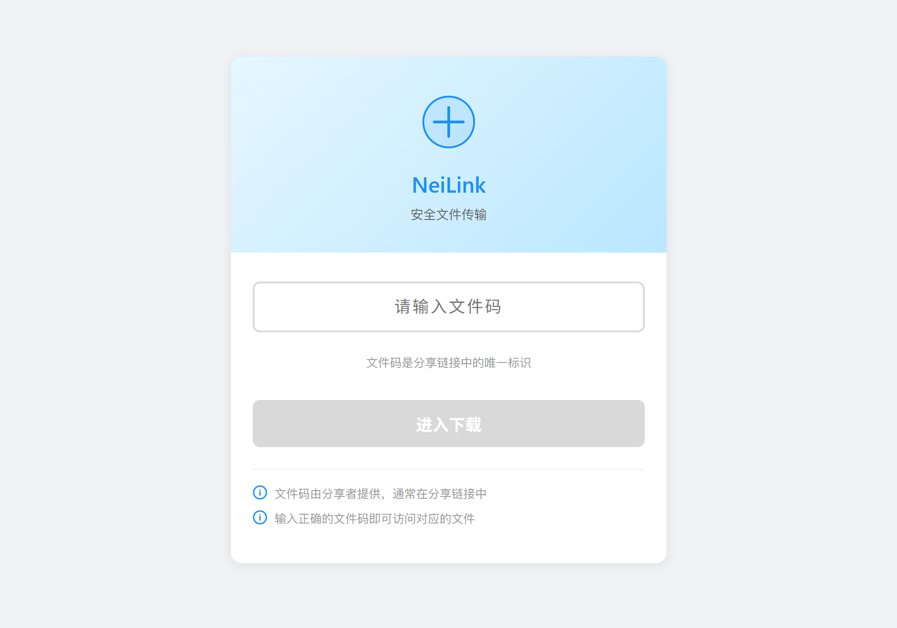
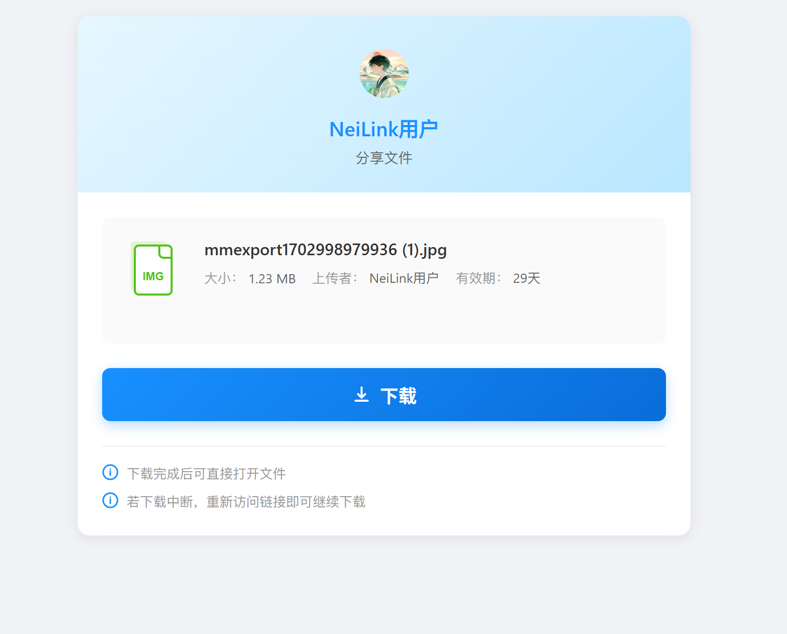

<p align="center">
  
</p>

<h1 align="center">NeiLink（轻连）</h1>

<p align="center">
  <strong>让局域网文件分享更简单</strong>
</p>

<p align="center">
  
  
  
  
</p>

---

## 目录

- [项目概述](#-项目概述)
- [核心功能](#-核心功能)
- [软件截图](#-软件截图)
- [技术架构](#-技术架构)
- [安装指南](#-安装指南)
- [使用流程](#-使用流程)
- [网络适配](#-网络适配)
- [常见问题](#-常见问题)
- [贡献指南](#-贡献指南)
- [许可证](#-许可证)

---

## 📋 项目概述

NeiLink（轻连）是一款面向个人用户的跨平台局域网文件分享工具，专注在本地网络中快速、安全地分享文件。解决传统传输方式（U盘拷贝、云盘上传下载、聊天软件发送）存在的**速度慢、流量消耗大、文件大小受限、操作繁琐**等痛点。

### 核心价值

- **高效传输** — 基于局域网 / 热点传输，无外网依赖，速度取决于本地网络带宽
- **便捷操作** — 一键发起分享，接收端仅需浏览器访问网址即可下载，无需安装额外软件
- **多端兼容** — 覆盖 Windows、macOS、Linux 三大桌面系统，接收端支持各类设备浏览器访问
- **安全可控** — AES-256-CBC 端到端加密，支持提取码验证、有效期与下载次数限制
- **灵活适配** — 自动适配局域网与热点模式，断网重连后保留分享配置

### 与传统传输方式对比

| 传输方式 | 速度 | 流量消耗 | 操作复杂度 | 文件大小限制 | 外网依赖 |
|:---|:---:|:---:|:---:|:---:|:---:|
| **🚀 NeiLink（轻连）** | **高（局域网带宽）** | **无** | **低（一键分享）** | **无限制** | **无** |
| U盘拷贝 | 中等 | 无 | 高（插拔 / 查找） | 受容量限制 | 无 |
| 云盘上传下载 | 低（受外网限速） | 大 | 高（上传+下载） | 受容量 / 会员限制 | 有 |
| 聊天软件发送 | 低（受外网限速） | 大 | 中等 | 有明确大小限制 | 有 |

---

## ✨ 核心功能

| 类别 | 功能 | 说明 |
|:---|:---|:---|
| 📂 文件处理 | 文件 / 文件夹分享 | 支持拖拽添加、右键分享，自动处理文件夹打包 |
| 🔒 安全 | AES-256-CBC 加密 | 端到端加密，保护敏感文件 |
| 🔒 安全 | 访问控制 | 可设置提取码、有效期、最大下载次数 |
| 📱 多端 | 跨设备访问 | PC、手机等多种设备通过浏览器访问 |
| 🎯 便捷 | 文件码系统 | 通过文件码快速定位和下载文件 |
| 📊 管理 | 分享管理 | 实时查看分享状态、下载统计，支持批量操作 |
| 🌐 网络 | 网络适配器选择 | 支持选择特定网络适配器进行分享 |
| 🔥 网络 | 热点功能 | 内置热点创建，应对 AP 隔离等特殊网络环境 |
| 📥 传输 | 断点续传 | 支持大文件断点续传，提升下载体验 |
| 📝 追溯 | 日志记录 | 详细的分享与下载记录，便于操作追溯 |
| 📈 监控 | 流量统计 | 实时监控分享流量，了解网络使用情况 |

---

## 🖥️ 软件截图

### 客户端

<table>
  <tr>
    <td align="center"><strong>主界面</strong></td>
    <td align="center"><strong>分享配置</strong></td>
  </tr>
  <tr>
    <td></td>
    <td></td>
  </tr>
  <tr>
    <td align="center"><strong>分享管理</strong></td>
    <td align="center"><strong>日志记录</strong></td>
  </tr>
  <tr>
    <td></td>
    <td></td>
  </tr>
  <tr>
    <td align="center"><strong>流量统计</strong></td>
    <td align="center"><strong>设置</strong></td>
  </tr>
  <tr>
    <td></td>
    <td></td>
  </tr>
  <tr>
    <td align="center" colspan="2"><strong>关于</strong></td>
  </tr>
  <tr>
    <td colspan="2"></td>
  </tr>
</table>

### 分享网页

| 主界面 | 下载界面 |
|:---:|:---:|
|  |  |

---

## 🛠️ 技术架构

| 层级 | 技术栈 |
|:---|:---|
| 客户端 | Electron + Node.js — 文件处理、网络适配、加密解密、日志记录 |
| 前端 | React + TypeScript + Ant Design — 接收端访问与下载交互 |
| 传输协议 | HTTP + AES-256-CBC 端到端加密 |
| 构建工具 | Webpack + TypeScript Compiler |

---

## 📦 安装指南

### 从发布包安装

访问 [Releases](https://github.com/Qiyao-sudo/NeiLink/releases) 页面下载对应平台的安装包。

### 从源码构建

```bash
# 克隆仓库
git clone https://github.com/Qiyao-sudo/NeiLink.git
cd NeiLink

# 安装依赖
npm install

# 构建项目
npm run build

# 运行开发服务器
npm run dev
```

---

## 📖 使用流程

### 分享文件

1. 点击「选择文件」按钮或拖拽文件 / 文件夹至软件界面
2. 配置分享选项（提取码、有效期、下载次数等）
3. 点击「开始分享」按钮
4. 复制生成的分享链接发送给接收方

### 接收文件

1. 打开分享链接
2. 如设置了提取码，输入提取码
3. 点击「下载」按钮开始下载（支持断点续传）

### 管理分享

在「分享管理」页面查看所有活跃的分享任务，支持编辑配置、取消分享、查看下载统计。

---

## 🌐 网络适配

- **局域网检测** — 自动识别 Wi-Fi、以太网等网络环境
- **热点模式** — 无网络时自动启动热点，支持 AP 隔离场景
- **断网重连** — 网络恢复后自动更新分享链接 IP，保持分享配置

---

## ❓ 常见问题

<details>
<summary><strong>无法访问分享链接</strong></summary>

- 确保分享方和接收方在同一局域网内
- 检查防火墙设置，确保端口已开放
- 尝试切换网络适配器或开启热点
</details>

<details>
<summary><strong>下载速度慢</strong></summary>

- 确保网络连接稳定
- 避免同时进行大量网络活动
- 对于大文件，建议使用有线网络连接
</details>

<details>
<summary><strong>分享链接失效</strong></summary>

- 检查分享是否已过期
- 检查分享是否已被取消
- 检查网络连接是否正常
</details>

---

## 🤝 贡献指南

欢迎贡献代码、报告问题或提出建议！请参阅 [CONTRIBUTING.md](CONTRIBUTING.md) 了解如何参与。

## 📄 许可证

本项目采用 [MIT License](LICENSE) 开源协议。

## 📞 联系方式

- **GitHub**：[Qiyao-sudo/NeiLink](https://github.com/Qiyao-sudo/NeiLink)
- **Issue**：[提交问题](https://github.com/Qiyao-sudo/NeiLink/issues)

---

<p align="center">
  <strong>NeiLink — 让局域网文件分享更简单</strong>
</p>
